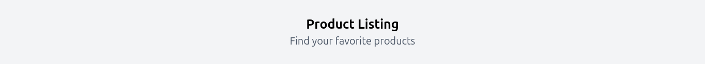
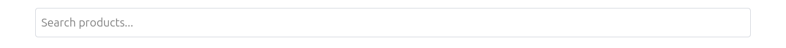
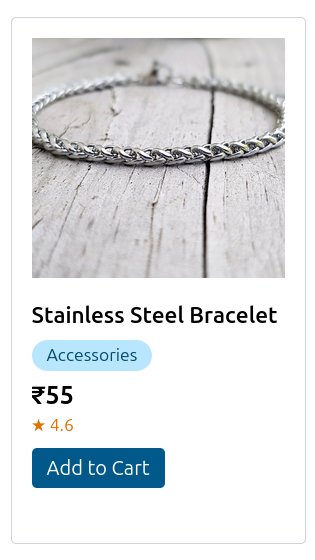
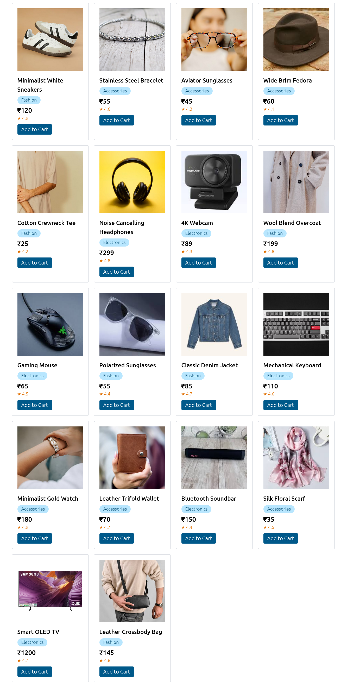

# Product List

A responsive Product Listing Page built using React.
This project demonstrates core React concepts like components, state management, filtering, sorting, and event handling.

## Features
- Display products in a responsive grid layout
- Search products by name
- Filter products by category
- Sort products by:
Price (Low → High / High → Low)
Rating
- Add to Cart button (logs product name)
- Clean UI with responsive design
- Reusable components

## Concepts Used
React Functional Components
Props
useState
Event Handling
Conditional Rendering
Array Methods (map, filter, sort)

## Tech Used
- React
- JavaScript (ES6+)
- Tailwind CSS

## Installation & Setup

- Clone the repository:
git clone https://github.com/your-username/product-listing-app.git

- Navigate to project folder:
cd product-listing-app

- Install dependencies:
npm install

- Start development server:
npm run dev

### Screenshots

